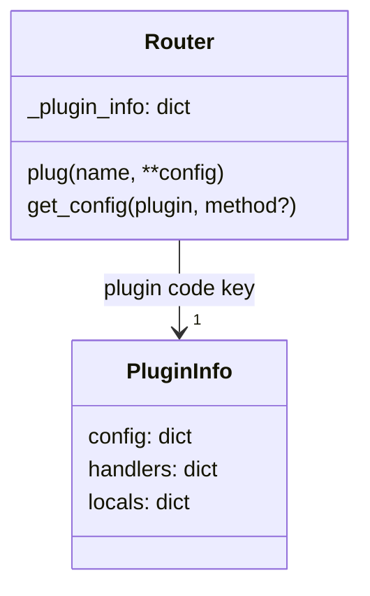

# SmartRoute Architecture (current state)

This document is the source of truth for how routing, hierarchy, and plugins work after the recent refactors (no `describe`, single plugin store on routers). Diagrams use Mermaid.

## Router and hierarchy

```mermaid
graph TD
  RC[RoutedClass instance]
  Router[Router (per instance)]
  ChildRC[Child RoutedClass]
  ChildRouter[Child Router]

  RC -->|attribute| Router
  RC -->|attribute| ChildRC
  ChildRC -->|attribute| ChildRouter
  Router -->|attach_instance(name/mapping)| ChildRouter
  Router -->|members| M[Members tree]
```

- Hierarchies are only via `attach_instance`/`detach_instance` (instance-to-instance).
- Branch routers (`branch=True`) exist but do not auto-discover handlers.
- Introspection: `members()` is the sole API; it returns router/instance, handlers (with metadata, doc, signature, plugins, params), children, and `plugin_info`.

## Plugin store

Single authoritative store per router: `router._plugin_info` (exposed via `members`).



Shape:
```json
{
  "plugin_code": {
    "config": { "enabled": true, ... },   // router-level defaults
    "handlers": { "entry_name": { ... }}, // per-entry overrides
    "locals": { ... }                     // optional live data owned by plugin
  }
}
```

### Plugin lifecycle
- `plug("name", **config, method_config=...)`:
  - instantiates plugin;
  - binds it to the router;
  - seeds `plugin_info[name].config` and `.handlers` from the provided config.
- Inheritance (`_on_attached_to_parent`):
  - clones plugin specs;
  - binds cloned plugins to child router;
  - copies parent `_plugin_info` bucket per plugin (config/handlers); locals start empty.
- Detach of instances leaves plugin store on surviving routers untouched.

### Plugin API (after refactor)
- `BasePlugin` no longer keeps `_global_config/_handler_configs`.
- `get_config`, `set_config`, `set_method_config`, and `configure` proxies read/write the router store.
- Plugins should read config at call time (no baked-in closures) so live updates apply without rebuild.

## Introspection data (`members`)

```mermaid
graph LR
  R[Router] --> H[handlers]
  R --> C[children]
  R --> P[plugin_info]
  H --> E1[entry -> {callable, metadata, doc, signature, return_type, plugins, parameters, metadata_keys, extras}]
  C --> Rchild[child router ...]
```

- Filters (`scopes`, `channel`) apply to handlers and children; empty children pruned only when filters are active.
- `plugin_info` is included for routers; entries can mirror plugin info if desired, but the authoritative store is on the router.

## Admin/CLI/UI implications
- You can render a full tree (routers → children → handlers) with plugin config shown from `plugin_info`.
- Updates can target router-level or per-entry config and take effect immediately if plugins read config live.
- Locals are for plugin-owned runtime data; treat them as non-config state.
